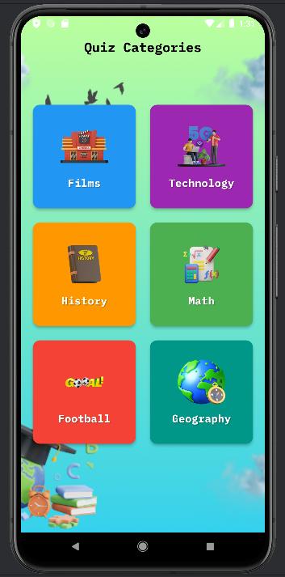
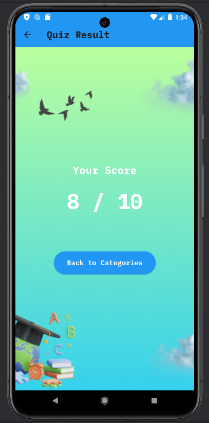

# Quiz App

Welcome to the Quiz App, a fun and interactive way to test your knowledge across various categories including Films, Technology, History, Math, Football, and Geography. Whether you're a trivia enthusiast or just looking to pass some time, this app offers a delightful experience with challenging questions and instant feedback.

## Features

* **Multiple Categories**: Choose from a variety of topics to test your knowledge.
* **Instant Feedback**: Get immediate feedback with fun animations for correct and incorrect answers.
* **Progress Tracking**: Visual progress bar to track your advancement through the questions.
* **Beautiful UI**: A clean and attractive interface with vibrant images and engaging animations.

## Screenshots

Here are some glimpses of the app in action:





## Future Improvements

* **Question-Specific Images**: Add relevant images for each question to enhance visual learning and engagement.
* **Timer Feature**: 
  - Implement a countdown timer for each question
  - Automatic progression to next question when time expires
  - Customizable time limits per difficulty level
* **Difficulty Levels**:
  - Easy, medium, and hard modes
  - Tailored questions for each difficulty level
  - Progressive difficulty system
* **Leaderboard System**:
  - Global rankings for all users
  - Category-specific leaderboards
  - Weekly and all-time high scores
* **Question Randomization**:
  - Shuffle questions within categories
  - Ensure unique question order in each playthrough
  - Smart shuffling to avoid recent repetitions

## Getting Started

To get started with this project, clone the repository and ensure you have Flutter installed on your machine.

```bash
git clone https://github.com/OumarLAM/quiz-app.git
cd quiz-app
```

### Prerequisites
Make sure you have Flutter installed. If you don't have Flutter installed, please follow the instructions on the Flutter official website.

### Installation
Run the following command to install the dependencies:

```bash
flutter pub get
```

### Running the App
Execute the following command to run the app on a connected device or emulator:

```bash
flutter run
```
## Built With

Flutter - The UI toolkit used for building natively compiled applications for mobile, web, and desktop from a single codebase.

## Contributing

Contributions are what make the open-source community such an amazing place to learn, inspire, and create. Any contributions you make are **greatly appreciated**.

1. Fork the Project

2. Create your Feature Branch (```git checkout -b feature/AmazingFeature```)

3. Commit your Changes (```git commit -m 'Add some AmazingFeature'```)

4. Push to the Branch (```git push origin feature/AmazingFeature```)

5. Open a **Pull Request**

## License
Distributed under the MIT License. 

## Author

👤 **Oumar LAM**

- Github: [Oumar LAM](https://github.com/OumarLAM)
- Twitter: [@OumarLAM](https://twitter.com/oumarlam_fcb)
